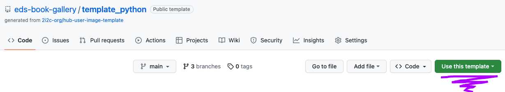
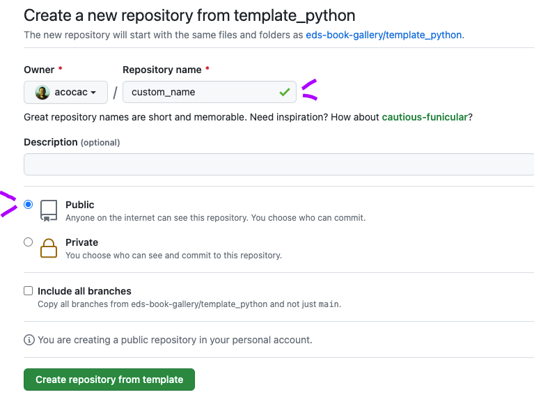
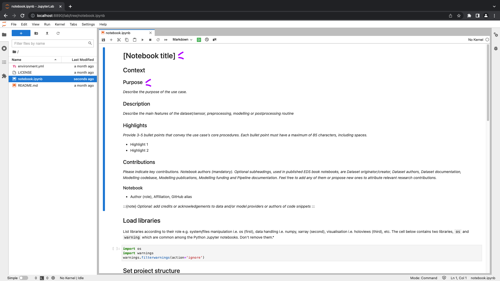
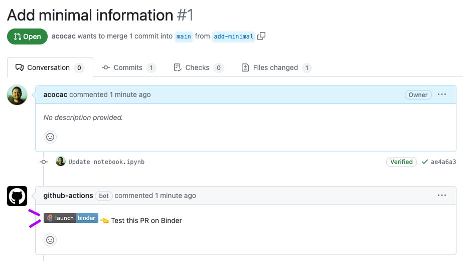
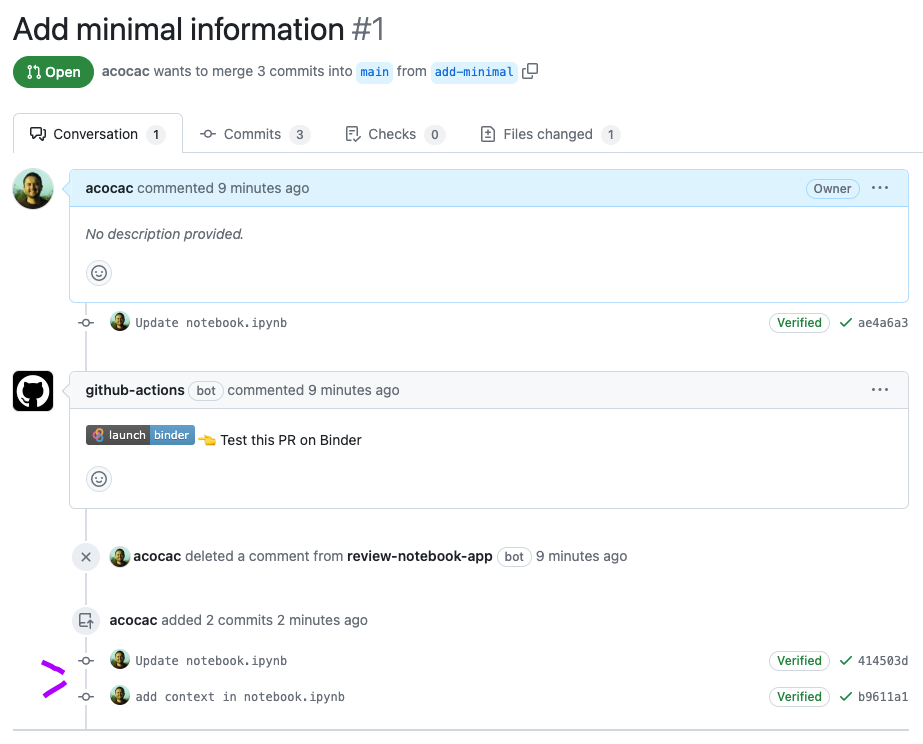
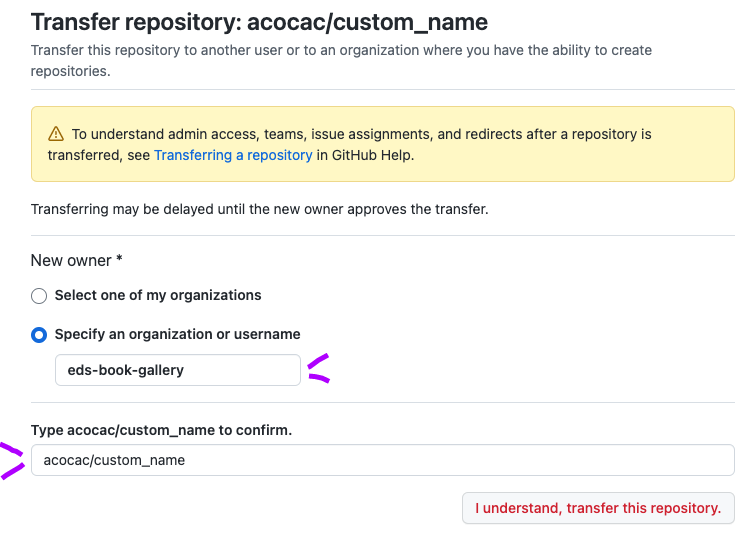

# Python Notebook Repository Template

This is a template repository containing a Jupyter notebook with a `python` kernel. 

Please follow the instructions below to prepare your notebook repository to publish in EDS book. 

Feel free to report bugs in the main EDS book repo ([here](https://github.com/alan-turing-institute/environmental-ds-book/issues/new/choose)).

## How to use the template

### :point_right: Step 1: Use the template

Login to your GitHub account, and click on "Use this template". Choose a new name!

 
Choose a new name for the repository and select the public option. Don’t choose include all branches. Then click in the Create repository from template.

### :point_right: Step 2: Clone and edit 

Clone the repo in your local/remote machine. You can follow some basics in Git commands in GitHub in The Turing Way (see [here](https://the-turing-way.netlify.app/reproducible-research/vcs/vcs-github.html?highlight=git%20commands%20work%20github)).

``
git clone <insert GitHub link of the repository here>
``

Create and checkout a branch with a name of your preference. 

``
git branch <branch name>
git checkout <branch name>
``

Don't rename the filename of the notebook.

Edit the notebook using the integrated development environment (IDE) of preference. We suggest visiting [Getting Started with Jupyter](https://foundations.projectpythia.org/foundations/getting-started-jupyter.html) by the Pythia project. 

The minimal information in the edition refers to the proposed title and purpose of the notebook. Feel free to copy and paste the information filled when you submitted the Notebook Idea issue in the main EDS book repository.

For instance, the following screenshot shows a notebook with minimal information requirement in `jupyter lab`. 

### :point_right: Step 3: Open a Pull Request (PR)

After editing the notebook with minimal information, you can create a PR to the main branch. If you aren’t familiar how to open a PR, we suggest following the guidelines in [Opening a Pull Request on GitHub](https://foundations.projectpythia.org/foundations/github/github-pull-request.html) by the Pythia project.

The PR will trigger a GitHub action workflow that posts a comment inside the PR. The comment contains a "Test this PR on Binder" badge, which can be used to access the image defined by the PR in mybinder.org.

### :point_right: Step 4: Test in Binder

The workflow posts a comment inside a pull request, every time a pull request gets opened. The comment contains a "Test this PR on Binder" badge, which can be used to access the image defined by the PR in mybinder.org.

### :point_right: Step 5 - Update 
You can update the notebook as many times you want within the same PR. You can also open a new PR, but make sure you merge or close previous PR. 

To start adding the notebook dependencies, you must update the `environment.yml` file. For instance, the screenshot below we pushed an `Update notebook.ipnyb` commit related to importing a new library in the Load libraries section. 

When the minimal working version of the notebook is ready, you should tag Editors-in-Chief (EiC) in the PR with the latest Binder badge. EiC will check how reproducible is the notebook and its feasibility for the reviewing stage.

After EiC’s approval of the draft version of the notebook, you transfer the notebook repository to the eds-book-gallery organisation. 

EiC will assist you to prepare the notebook repository for the review process.

### :point_right: Step 6 - Transfer 

When the first draft of the notebook is ready and reproducible in Binder, please transfer to the eds-book-gallery organisation. 
* Go to settings
* Click on Transfer 
* Type `eds-book-gallery` in the organisation name
* Type the name of your repository to confirm
* Click in I understand, transfer this repository

### :point_right: Step 7 - Reviewing process
EiC will open a PRE-REVIEW issue where a handling editor and authors suggest reviewers. The editor can give initial directions to authors for improving the notebook, especially if the notebook lacks some requested sections. Once reviewers agreed on the revision, EiC opens a REVIEW issue.

We suggest to read further details of the REVIEW process in the publishing guidelines (see [here](https://github.com/alan-turing-institute/environmental-ds-book/blob/master/book/publishing/guidelines/guidelines-authors.md)). 

## Credits
This template uses [2i2c’s hub-user-image-template](https://github.com/2i2c-org/hub-user-image-template) released under BSD-3-Clause license. We also acknowledge the [static-export-template](https://github.com/JuliaPluto/static-export-template) of Julia Pluto, in particular the well-documented README file.
